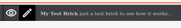
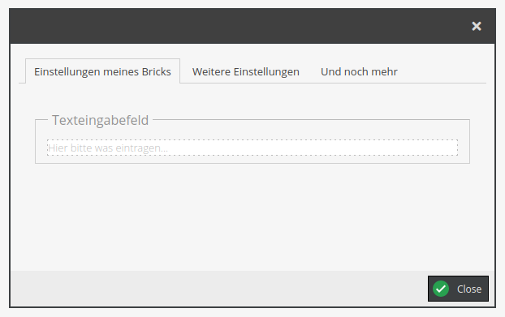
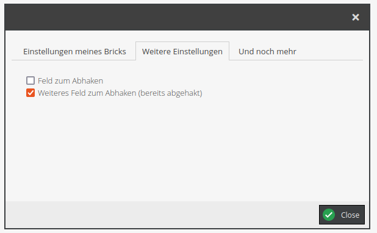
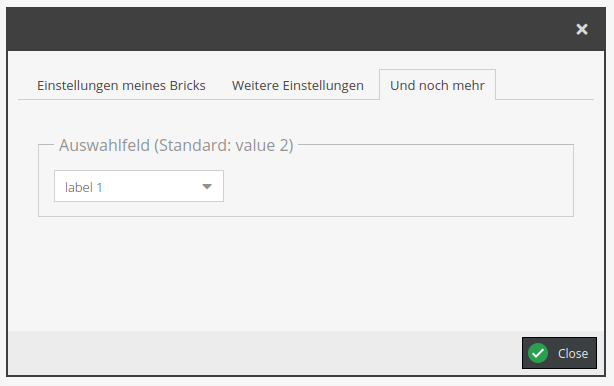

# Editor Config Bundle

Object-oriented editable dialog box configuration building for areabricks.

## Installation

Require via Composer

```shell
composer require teamneusta/pimcore-areabrick-config-bundle
```

As this is a Pimcore bundle, enable it.
```shell
console pimcore:bundle:enable NeustaPimcoreAreabrickConfigBundle
```

## Usage

You need this bundle if you want to stuff your areabricks easily with an editable config dialog.

A simple example should show how to do it.

### Areabrick Class

Your areabrick class must implement Pimcore's `Pimcore\Extension\Document\Areabrick\EditableDialogBoxInterface` interface
and additionally use the `Neusta\Pimcore\AreabrickConfigBundle\HasDialogBox` trait. 

Then it's up to you to implement the `buildDialogBox()` method as you wish.

```php
<?php

use Neusta\Pimcore\AreabrickConfigBundle\DialogBoxBuilder;
use Neusta\Pimcore\AreabrickConfigBundle\HasDialogBox;
use Pimcore\Extension\Document\Areabrick\AbstractTemplateAreabrick;
use Pimcore\Extension\Document\Areabrick\EditableDialogBoxInterface;
use Pimcore\Model\Document\Editable;
use Pimcore\Model\Document\Editable\Area\Info;

class MyAreabrick extends AbstractTemplateAreabrick implements EditableDialogBoxInterface
{   
    /** @template-use HasDialogBox<DialogBoxBuilder> */
    use HasDialogBox;

    /******************************************************************
     * This is the code you have to implement
     *****************************************************************/
    private function buildDialogBox(DialogBoxBuilder $dialogBox, Editable $area, ?Info $info): void
    {
        $dialogBox
            ->addTab('Einstellungen meines Bricks',
                $dialogBox->createInput('input-label')
                    ->setPlaceholder('Hier bitte was eintragen...')
                    ->setLabel('Texteingabefeld')
            )
            ->addTab('Weitere Einstellungen',
                $dialogBox->createCheckbox('checkbox-label-1')
                    ->setLabel('Feld zum Abhaken')
                    ->setDefaultUnchecked(),
                $dialogBox->createCheckbox('checkbox-label-2')
                    ->setLabel('Weiteres Feld zum Abhaken (bereits abgehakt)')
                    ->setDefaultChecked()
            )
            ->addTab('Und noch mehr',
                $dialogBox->createSelect(
                    'select-label',
                    [
                        'value 1' => 'label 1',
                        'value 2' => 'label 2',
                        'value 3' => 'label 3',
                    ]
                )
                    ->setLabel('Auswahlfeld (Standard: value 2)')
                    ->setDefaultValue('label 2')
            );
    }
    
    // other things may follow
}
```

As you can (nearly) see, we add a 3-tabbed-config dialog to our brick which can be opened by clicking on the pencil of
your areabrick:



The config dialog will be opened:






And after editing the values, they are accessible in the Twig template:
```html
  <p>
      Im Feld 'Texteingabefeld' wurde der Wert
      {{ pimcore_input('input-label').getData() }}
      gewählt.
  </p>
  <p>
      Die Checkbox 'Feld zum Abhaken' ist
      
          
              abgehakt.
          
              NICHT abgehakt.
          
      .
  </p>
  <p>
      Die Checkbox 'Weiteres Feld zum Abhaken (bereits abgehakt)' ist
      
          
              abgehakt.
          
              NICHT abgehakt.
          
  </p>
  <p>
      Im Auswahlfeld (Standard: wert 2) wurde der Wert
      {{ pimcore_select('select-label').getData() }}
      gewählt.
  </p>
```
## Contribution

Feel free to open issues for any bug, feature request, or other ideas.

Please remember to create an issue before creating large pull requests.

### Running tests for development

```shell
docker run -it --rm -v $(pwd):/app -w /app pimcore/pimcore:PHP8.1-cli composer install --ignore-platform-reqs
docker run -it --rm -v $(pwd):/app -w /app pimcore/pimcore:PHP8.1-cli composer test
```

### Further development

Pipelines will tell you when code does not meet our standards. To use the same tools in local development, 
take the Docker command from above with other scripts from the `composer.json`. For example:

* cs:check
* phpstan

```shell
docker run -it --rm -v $(pwd):/app -w /app pimcore/pimcore:PHP8.1-cli composer <composer-script>
```
